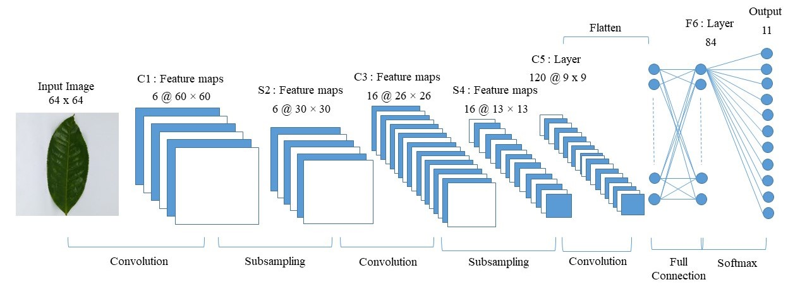

<!DOCTYPE html>
<html>
  <h1>
    <strong>GAMBUNG TEA LEAVES CLASSIFICATION OF ASSAMICA VARIETIES USING CONVOLUTIONAL NEURAL NETWORK WITH LENET-5 ARCHITECTURE</strong>
  </h1>
  <body>
   <h2>Background</h2>
    
Indonesia is one of the largest processing of gambung tea products. Gambung
tea products produced with different types of tea. However, the quality of the product
processing system has decreased because farmers are difficult to distinguish the
types of production of tea leaves with superior tea leaves and still use manual processing
procedures. It is known, gambung tea leaves has 11 types of clones. GMB
tea leaves (1-11) are superior tea clones of the type assamica and sinensis from the
research of the Tea and Quinine Research Center (PPTK). Therefore, technology is
needed to recognize the types of tea leaves as an increase in product quality.

    
This research makes a classification by using the Convolutional Neural Network
(CNN) method as a classification algorithm. Leaf image data classification process
will be tested to 11 types of clone leaves by the number of dataset of 1100 data as
well as augmentation of testing using the data for 4400 data. The LeNet-5 architecture
will be used in the classification model testing.

    
Architectural testing was performed with Adam, SGD, RMSprop, and Adagrad
optimizer parameters with comparative learning rate values of 0.1, 0.01, 0.001, and
0.0001. The classification process is obtained with an accuracy value of 94.55%
with Adam optimizer parameter and the learning rate used of 0.001.

    
<h2>The Basic Concepts</h2>
  
Gambung tea leaves or GMB is  clone tea that has 11 superior tea clones of assamica varieties from research results from the Tea and Quinine Research Center (PPTK). 
GMB tea leaves have various morphological variations, both in terms of shape & texture. However, It would be difficult to see with the naked eye.  
Because the level of similarity is very high due to the same crossing process. Look at the pictures, you can't compare every clones if you don't know the morphology of leaf first.

  <figure>
      <figcaption>Fig.1 - Leaf shape of GMB 1 to GMB 11 clones in order.</figcaption>
      
    </figure>      

    
  

  Convolutional Neural Network (CNN) is one method for processing two-dimensional images. The CNN method is the development of Multi-Layer Perception (MLP) which consists of convolution and classification learning features. CNN is a technique of DL that consists of several layers and is designed for the implementation of image and sound. CNN was first developed by Fukushima, et al (1982) and then matured by LeCun, et al (1998) by introducing the LeNet architecture on the recognition of numeric writing. Based on the architecture, CNN consists of an input layer and an output layer as in a layered hidden layer. The hidden layer on CNN consists of a convolution layer, a convolution layer in which the data weight values are processed by multiplying or multiplying other points. Values that have been convoluted will be continued with additional convolutions, namely pooling layers, fully connected layers, and normalization layers. Even though the inner layer
colloquially referred to as convolution, it is simply by convention. Mathematically, the convolution technique is the product of shear points or cross-correlation. This has significance for indexes in an array, as it affects how weights are determined at a given index point. The convolution process can be seen in Figure 2.
    

    <figure>
      <figcaption>Fig.2 - CNN Process.</figcaption>
       
    </figure>  
 
  

      The architecture that will be tested in the CNN processing method is the LeNet-5 architecture. LeNet-5 is a CNN-based architecture introduced by LeCun, et al (1998). LeNet-5 has a higher number of independent parameters or number of layers than previous CNN systems.

    
 
    
    
   

      The LeNet-5 architecture in Figure 3 consists of 3 convolutional layers, and 2 pooling layers, and ends with 2 fully connected layers and 1 fully connected with a softmax function classification. The LeNet-5 architecture has been developed and used as the basic architecture of CNN and has been tested by researchers with test image data, namely number writing recognition (MNIST) with grayscale color conditions (LeCun, et al 1998), CIFAR data with RGB color conditions (Xie, et al., 1998). et al 2017), as well as traffic sign recognition data. The research has been tested quite well and can be used to develop CNN on the data to be tested.
   

   
<h2>Reasearch Methods</h2> 
    
The GMB image classification method begins with determining the image dataset and continues with the feature extraction process using the CNN method with LeNet-5 architecture. The architecture consists of 6 layers, namely 3 convolution layers, 2 subsampling layers, and 1 fully connected layer. The hyperparameters used in the convolution screen are kernel size (5x5), stride size (1x1), and activation of the ReLU function. As for the subsampling or pooling layer, the hyperparameters used are kernel size 2x2 and stride size 2x2. Next, the Fully Connected (FC) process is carried out with the 84 units and continued with FC with activation of the softmax function so that the output is 11 units as an evaluation of the network value from the classification results. The following is the configuration of the LeNet-5 architecture used in Table 1.

    <table>
     <caption style="text-align:center">Architecture Configuration Table LeNet-5</caption> 
     <tr>
       <th colspan="2">Layer</th>
       <th>Feature Map</th>
       <th>Kernel Size</th>
       <th>Stride</th>
       <th>Activation</th>
      </tr>
      <tr>
        <th>Input</th>
        <th>Image</th>
        <th>1</th>
        <th>-</th>
        <th>-</th>
        <th>-</th>
      </tr>
      <tr>
        <td>1</td>
        <td>Convolution 1</td>
        <td>6</td>
        <td>5X5</td>
        <td>1</td>
        <td>ReLU</td>
      </tr>
      <tr>
        <td>2</td>
        <td>Maxpooling 1</td>
        <td>6</td>
        <td>2X2</td>
        <td>2</td>
        <td>-</td>
      </tr>
      <tr>
        <td>3</td>
        <td>Convolution 2</td>
        <td>16</td>
        <td>5X5</td>
        <td>1</td>
        <td>ReLU</td>
      </tr>  
      <tr>
        <td>4</td>
        <td>Maxpooling 2</td>
        <td>16</td>
        <td>2X2</td>
        <td>2</td>
        <td>-</td>
      </tr>
      <tr>
        <td>5</td>
        <td>Convolution 3</td>
        <td>120</td>
        <td>5X5</td>
        <td>-</td>
        <td>ReLU</td>
      </tr>
      <tr>
        <td>6</td>
        <td>FC</td>
        <td>-</td>
        <td>84</td>
        <td>-</td>
        <td>ReLU</td>
      </tr>
      <tr>
        <td>Output</td>
        <td>FC</td>
        <td>-</td>
        <td>11</td>
        <td>-</td>
        <td>Softmax</td>
      </tr>
    </table>
   
   
   
   
The image data classification method will be carried out in several stages. Figure above shows the stages of the system and will be used as a research method. The first stage is image acquisition, which is the stage of data collection for tea clones from the GMB series, and adjustments to the specifications of the GMB clones are made into 11 classes. The GMB image data was taken using a smartphone camera with size specifications of 13, 25, and 48 megapixels. The second stage is the preprocessing process, namely changing the size of the image data and performing the data augmentation process. After the preprocessing process has been carried out, it will proceed to the third stage with the classification process of training data and test data. The training data is used to obtain the achievement of the image data test, while the test data is used to test the performance and correctness or correlation of the training data in the image model.
 
    
   <h2>Results and Discussion</h2>
    
The training data and test data are 1100 and 880, respectively. The training data will be augmented before carrying out the classification process. The size of the image data to be classified is 64×64. Classification system modeling will be trained using the Adam optimizer with a learning rate of 0.001 and look for the best accuracy, loss, and F1-score values for the influence of these parameters.

   <table>
      <caption style="text-align:center">Results Validation accuracy with augmentation data and the best parameters.</caption>
      <tr>
        <th colspan="6">Model + Augmentasi Data + Optimizer Adam(lr=0.001)</th>
      </tr>
      <tr>
        <th>Epoch</th>
        <th>Validation Accuracy</th>
        <th>Validation Loss</th>
        <th>Precision</th>
        <th>Recall</th>
        <th>F1-Score</th>
      </tr>
      <tr>
        <td>7</td>
        <td>70.45%</td>
        <td>29.55%</td>
        <td>73%</td>
        <td>71%</td>
        <td>70%</td>
      </tr>
      <tr>
        <td>10</td>
        <td>85.90%</td>
        <td>14.1%</td>
        <td>87%</td>
        <td>87%</td>
        <td>86%</td>
      </tr>
      <tr>
        <td>13</td>
        <td>94.55%</td>
        <td>5.45%</td>
        <td>96%</td>
        <td>94%</td>
        <td>94%</td>
      </tr>
    </table>
  
  
  
    <figure>
    </figure>
  </body>
</html>
