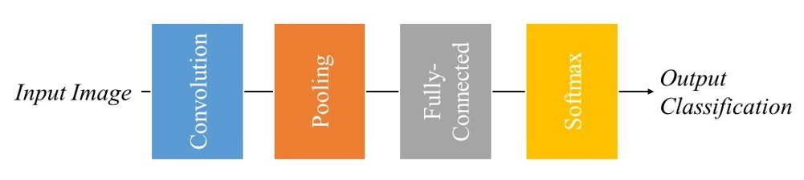

<!DOCTYPE html>
<html>
  <h1>
    <strong>GAMBUNG TEA LEAVES CLASSIFICATION OF ASSAMICA VARIETIES USING CONVOLUTIONAL NEURAL NETWORK WITH LENET-5 ARCHITECTURE</strong>
  </h1>
  <body>
   <h2>Background</h2>
    
Indonesia is one of the largest processing of gambung tea products. Gambung
tea products produced with different types of tea. However, the quality of the product
processing system has decreased because farmers are difficult to distinguish the
types of production of tea leaves with superior tea leaves and still use manual processing
procedures. It is known, gambung tea leaves has 11 types of clones. GMB
tea leaves (1-11) are superior tea clones of the type assamica and sinensis from the
research of the Tea and Quinine Research Center (PPTK). Therefore, technology is
needed to recognize the types of tea leaves as an increase in product quality.

    
This research makes a classification by using the Convolutional Neural Network
(CNN) method as a classification algorithm. Leaf image data classification process
will be tested to 11 types of clone leaves by the number of dataset of 1100 data as
well as augmentation of testing using the data for 4400 data. The LeNet-5 architecture
will be used in the classification model testing.

    
Architectural testing was performed with Adam, SGD, RMSprop, and Adagrad
optimizer parameters with comparative learning rate values of 0.1, 0.01, 0.001, and
0.0001. The classification process is obtained with an accuracy value of 94.55%
with Adam optimizer parameter and the learning rate used of 0.001.

    
<h2>The Basic Concepts</h2>

Gambung tea leaves or GMB is  clone tea that has 11 superior tea clones of assamica varieties from research results from the Tea and Quinine Research Center (PPTK). 
GMB tea leaves have various morphological variations, both in terms of shape & texture. However, It would be difficult to see with the naked eye.  
Because the level of similarity is very high due to the same crossing process. Look at the pictures, you can't compare every clones if you don't know the morphology of leaf first.

Convolutional Neural Network (CNN) is one method for processing two-dimensional images. The CNN method is the development of Multi-Layer Perception (MLP) which consists of convolution and classification learning features. CNN is a technique of DL that consists of several layers and is designed for the implementation of image and sound. CNN was first developed by Fukushima, et al (1982) and then matured by LeCun, et al (1998) by introducing the LeNet architecture on the recognition of numeric writing. Based on the architecture, CNN consists of an input layer and an output layer as in a layered hidden layer. The hidden layer on CNN consists of a convolution layer, a convolution layer in which the data weight values are processed by multiplying or multiplying other points. Values that have been convoluted will be continued with additional convolutions, namely pooling layers, fully connected layers, and normalization layers. Even though the inner layer
colloquially referred to as convolution, it is simply by convention. Mathematically, the convolution technique is the product of shear points or cross-correlation. This has significance for indexes in an array, as it affects how weights are determined at a given index point. The convolution process can be seen in Figure 2.

  
  
  </body>
</html>
